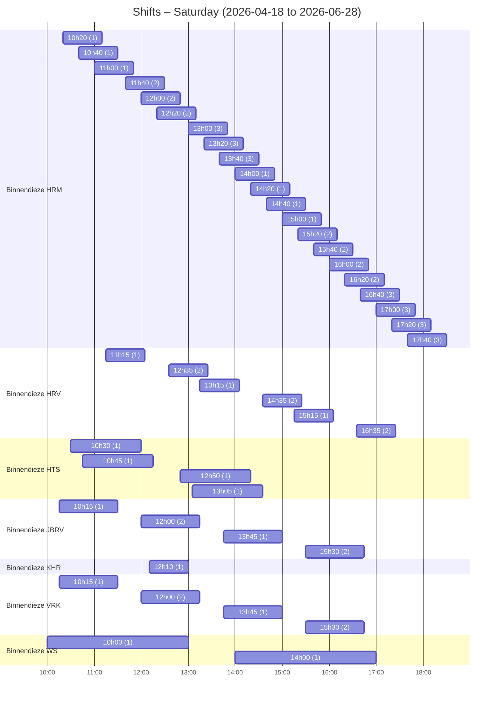
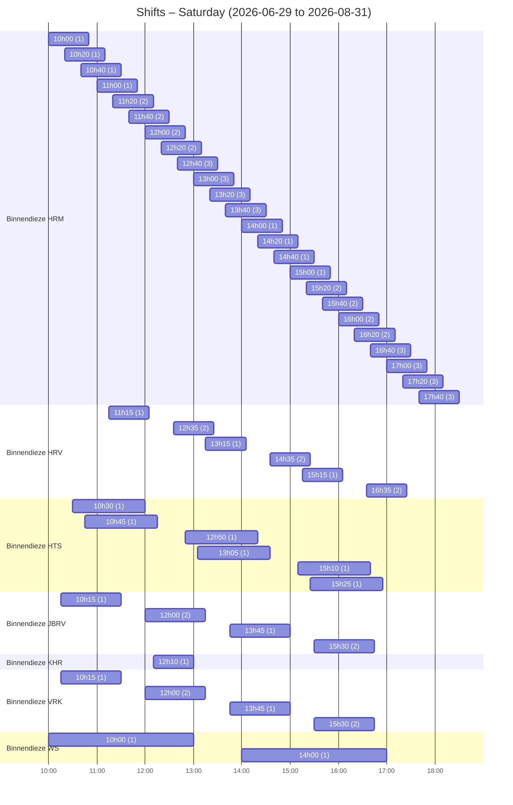
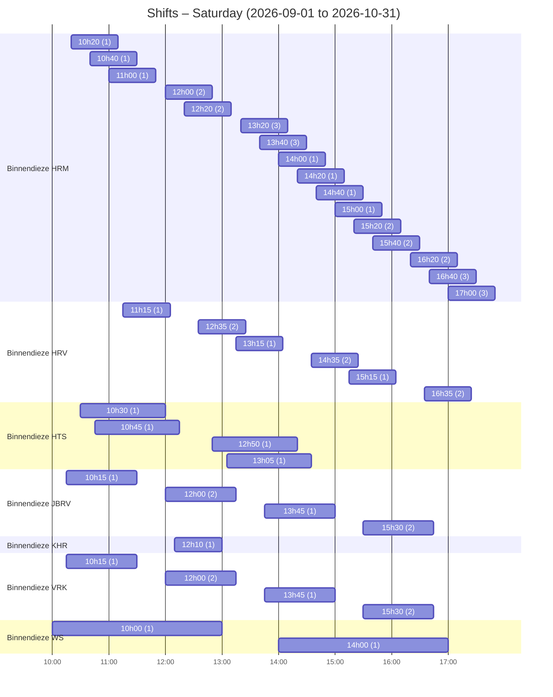

## 2026-04-01 – 2026-04-17 (Sat)

```mermaid
gantt
    title Shifts – Saturday (2026-04-01 to 2026-04-17)
    dateFormat HH:mm
    axisFormat %H:%M

    section Binnendieze HRM
        10h20 (1) : 10:20, 50m
        10h40 (1) : 10:40, 50m
        11h00 (1) : 11:00, 50m
        12h00 (2) : 12:00, 50m
        12h20 (2) : 12:20, 50m
        13h20 (3) : 13:20, 50m
        13h40 (3) : 13:40, 50m
        14h00 (1) : 14:00, 50m
        14h20 (1) : 14:20, 50m
        14h40 (1) : 14:40, 50m
        15h00 (1) : 15:00, 50m
        15h20 (2) : 15:20, 50m
        15h40 (2) : 15:40, 50m
        16h20 (2) : 16:20, 50m
        16h40 (3) : 16:40, 50m
        17h00 (3) : 17:00, 50m

    section Binnendieze HRV
        11h15 (1) : 11:15, 50m
        12h35 (2) : 12:35, 50m
        13h15 (1) : 13:15, 50m
        14h35 (2) : 14:35, 50m
        15h15 (1) : 15:15, 50m
        16h35 (2) : 16:35, 50m

    section Binnendieze HTS
        10h30 (1) : 10:30, 90m
        10h45 (1) : 10:45, 90m
        12h50 (1) : 12:50, 90m
        13h05 (1) : 13:05, 90m

    section Binnendieze JBRV
        10h15 (1) : 10:15, 75m
        12h00 (2) : 12:00, 75m
        13h45 (1) : 13:45, 75m
        15h30 (2) : 15:30, 75m

    section Binnendieze KHR
        12h10 (1) : 12:10, 50m

    section Binnendieze VRK
        10h15 (1) : 10:15, 75m
        12h00 (2) : 12:00, 75m
        13h45 (1) : 13:45, 75m
        15h30 (2) : 15:30, 75m

    section Binnendieze WS
        10h00 (1) : 10:00, 180m
        14h00 (1) : 14:00, 180m
```

## 2026-04-18 – 2026-06-28 (Sat)

```mermaid
gantt
    title Shifts – Saturday (2026-04-18 to 2026-06-28)
    dateFormat HH:mm
    axisFormat %H:%M

    section Binnendieze HRM
        10h20 (1) : 10:20, 50m
        10h40 (1) : 10:40, 50m
        11h00 (1) : 11:00, 50m
        11h40 (2) : 11:40, 50m
        12h00 (2) : 12:00, 50m
        12h20 (2) : 12:20, 50m
        13h00 (3) : 13:00, 50m
        13h20 (3) : 13:20, 50m
        13h40 (3) : 13:40, 50m
        14h00 (1) : 14:00, 50m
        14h20 (1) : 14:20, 50m
        14h40 (1) : 14:40, 50m
        15h00 (1) : 15:00, 50m
        15h20 (2) : 15:20, 50m
        15h40 (2) : 15:40, 50m
        16h00 (2) : 16:00, 50m
        16h20 (2) : 16:20, 50m
        16h40 (3) : 16:40, 50m
        17h00 (3) : 17:00, 50m
        17h20 (3) : 17:20, 50m
        17h40 (3) : 17:40, 50m

    section Binnendieze HRV
        11h15 (1) : 11:15, 50m
        12h35 (2) : 12:35, 50m
        13h15 (1) : 13:15, 50m
        14h35 (2) : 14:35, 50m
        15h15 (1) : 15:15, 50m
        16h35 (2) : 16:35, 50m

    section Binnendieze HTS
        10h30 (1) : 10:30, 90m
        10h45 (1) : 10:45, 90m
        12h50 (1) : 12:50, 90m
        13h05 (1) : 13:05, 90m

    section Binnendieze JBRV
        10h15 (1) : 10:15, 75m
        12h00 (2) : 12:00, 75m
        13h45 (1) : 13:45, 75m
        15h30 (2) : 15:30, 75m

    section Binnendieze KHR
        12h10 (1) : 12:10, 50m

    section Binnendieze VRK
        10h15 (1) : 10:15, 75m
        12h00 (2) : 12:00, 75m
        13h45 (1) : 13:45, 75m
        15h30 (2) : 15:30, 75m

    section Binnendieze WS
        10h00 (1) : 10:00, 180m
        14h00 (1) : 14:00, 180m
```

## 2026-06-29 – 2026-08-31 (Sat)

```mermaid
gantt
    title Shifts – Saturday (2026-06-29 to 2026-08-31)
    dateFormat HH:mm
    axisFormat %H:%M

    section Binnendieze HRM
        10h00 (1) : 10:00, 50m
        10h20 (1) : 10:20, 50m
        10h40 (1) : 10:40, 50m
        11h00 (1) : 11:00, 50m
        11h20 (2) : 11:20, 50m
        11h40 (2) : 11:40, 50m
        12h00 (2) : 12:00, 50m
        12h20 (2) : 12:20, 50m
        12h40 (3) : 12:40, 50m
        13h00 (3) : 13:00, 50m
        13h20 (3) : 13:20, 50m
        13h40 (3) : 13:40, 50m
        14h00 (1) : 14:00, 50m
        14h20 (1) : 14:20, 50m
        14h40 (1) : 14:40, 50m
        15h00 (1) : 15:00, 50m
        15h20 (2) : 15:20, 50m
        15h40 (2) : 15:40, 50m
        16h00 (2) : 16:00, 50m
        16h20 (2) : 16:20, 50m
        16h40 (3) : 16:40, 50m
        17h00 (3) : 17:00, 50m
        17h20 (3) : 17:20, 50m
        17h40 (3) : 17:40, 50m

    section Binnendieze HRV
        11h15 (1) : 11:15, 50m
        12h35 (2) : 12:35, 50m
        13h15 (1) : 13:15, 50m
        14h35 (2) : 14:35, 50m
        15h15 (1) : 15:15, 50m
        16h35 (2) : 16:35, 50m

    section Binnendieze HTS
        10h30 (1) : 10:30, 90m
        10h45 (1) : 10:45, 90m
        12h50 (1) : 12:50, 90m
        13h05 (1) : 13:05, 90m
        15h10 (1) : 15:10, 90m
        15h25 (1) : 15:25, 90m

    section Binnendieze JBRV
        10h15 (1) : 10:15, 75m
        12h00 (2) : 12:00, 75m
        13h45 (1) : 13:45, 75m
        15h30 (2) : 15:30, 75m

    section Binnendieze KHR
        12h10 (1) : 12:10, 50m

    section Binnendieze VRK
        10h15 (1) : 10:15, 75m
        12h00 (2) : 12:00, 75m
        13h45 (1) : 13:45, 75m
        15h30 (2) : 15:30, 75m

    section Binnendieze WS
        10h00 (1) : 10:00, 180m
        14h00 (1) : 14:00, 180m
```

## 2026-09-01 – 2026-10-31 (Sat)

```mermaid
gantt
    title Shifts – Saturday (2026-09-01 to 2026-10-31)
    dateFormat HH:mm
    axisFormat %H:%M

    section Binnendieze HRM
        10h20 (1) : 10:20, 50m
        10h40 (1) : 10:40, 50m
        11h00 (1) : 11:00, 50m
        12h00 (2) : 12:00, 50m
        12h20 (2) : 12:20, 50m
        13h20 (3) : 13:20, 50m
        13h40 (3) : 13:40, 50m
        14h00 (1) : 14:00, 50m
        14h20 (1) : 14:20, 50m
        14h40 (1) : 14:40, 50m
        15h00 (1) : 15:00, 50m
        15h20 (2) : 15:20, 50m
        15h40 (2) : 15:40, 50m
        16h20 (2) : 16:20, 50m
        16h40 (3) : 16:40, 50m
        17h00 (3) : 17:00, 50m

    section Binnendieze HRV
        11h15 (1) : 11:15, 50m
        12h35 (2) : 12:35, 50m
        13h15 (1) : 13:15, 50m
        14h35 (2) : 14:35, 50m
        15h15 (1) : 15:15, 50m
        16h35 (2) : 16:35, 50m

    section Binnendieze HTS
        10h30 (1) : 10:30, 90m
        10h45 (1) : 10:45, 90m
        12h50 (1) : 12:50, 90m
        13h05 (1) : 13:05, 90m

    section Binnendieze JBRV
        10h15 (1) : 10:15, 75m
        12h00 (2) : 12:00, 75m
        13h45 (1) : 13:45, 75m
        15h30 (2) : 15:30, 75m

    section Binnendieze KHR
        12h10 (1) : 12:10, 50m

    section Binnendieze VRK
        10h15 (1) : 10:15, 75m
        12h00 (2) : 12:00, 75m
        13h45 (1) : 13:45, 75m
        15h30 (2) : 15:30, 75m

    section Binnendieze WS
        10h00 (1) : 10:00, 180m
        14h00 (1) : 14:00, 180m
```
